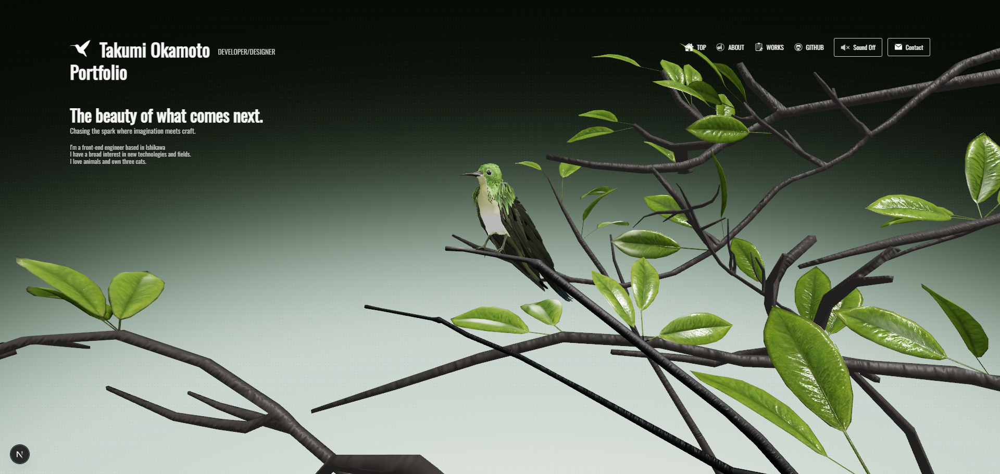

# portfolio

Next.js と react-three/fiber で制作した、3D 表現を主役にしたポートフォリオサイトです。
スクロールに連動して 3D シーンとカメラが動き、各セクション（About / Works / Contact）へ
シームレスに遷移していく、1 ページ完結型の構成になっています。



🔗 **公開サイト**: https://to-dev.jp

## このサイトについて

ハチドリの 3D モデルを中心に据え、スクロール位置に応じてカメラワークと
モデルのアニメーションが切り替わる演出を実装しています。Works セクションの
制作実績は microCMS から取得し、コンテンツをコードから分離しています。
お問い合わせフォームは別途用意した Go(Echo) 製の API と連携しています。

フロントエンドの実装力と 3D 表現を一つの作品として見ていただくことを目的に、
「動くものを作る」だけでなく、状態管理やコンポーネント設計の保守性にも
踏み込んで制作・リファクタリングを行いました。

## 主な機能

- スクロール連動の 3D カメラワーク・モデルアニメーション
- セクション（Top / About / Works / Contact）の自動切り替え
- microCMS から取得した制作実績の表示
- 全リソースの読み込み・GPU コンパイル完了を待つローディング画面
- BGM の再生／停止（タブ非アクティブ時は自動停止）
- Go(Echo) 製 API と連携したお問い合わせフォーム
- GLSL シェーダによる画面遷移エフェクト

## 技術スタック

### フロントエンド

- **Next.js** (App Router) / **TypeScript**
- **react-three/fiber** / **Three.js** — 3D 描画
- **@react-three/drei** — Three.js ユーティリティ
- **maath** — アニメーションのイージング
- **CSS Modules** — スタイリング

### 3D / コンテンツ

- **Blender** — 3D モデル制作
- **GLSL** — カスタムシェーダ
- **microCMS** — 制作実績の管理（ヘッドレス CMS）

### 連携 API（別リポジトリ）

- **Go(Echo)** — お問い合わせフォームの送信 API

## 設計上の工夫

採用担当の方・エンジニアの方に特に見ていただきたい実装上の判断です。

### 1. スクロール状態管理の責務分離

サイト全体がスクロール位置に駆動されるため、スクロール周りの状態管理が
複雑になりがちです。そこで、関心ごとに以下の 3 層へ分離しました。

- **`useScroll`** — スクロール量から現在のセクションや進捗を導出する「計算」に専念
- **`useScrollController`** — スクロールコンテナの `ref` 保持、スクロール／リサイズの
  監視、特定セクションへのジャンプといった「DOM 操作」を集約
- **`ScrollProvider`** — 上記 2 つを束ね、Context として配布する薄い層

当初は `getElementById` による DOM 操作やスクロール処理の重複が各コンポーネントに
散在していましたが、「計算」「DOM 操作」「配布」という責務で線を引き直すことで、
各コンポーネントは Context から必要なものを受け取るだけになり、見通しと
保守性を改善しました。セクションへのジャンプ位置などのマジックナンバーも
定数として一元管理しています。

### 2. スクロール位置に連動した 3D アニメーション制御

スクロールの進捗に応じて、3D モデルのアニメーションクリップ（intro / works / fly）の
切り替えと、カメラの位置・回転を制御しています。カメラ移動は `maath` のイージングで
補間し、目標位置に十分近づいた時点でスナップさせて誤差を消すことで、
滑らかさと最終位置の正確さを両立させています。マウス位置に応じた
モデルの微妙な傾きも加え、インタラクティブ性を持たせています。

### 3. リソース読み込みとローディング画面

3D モデル・テクスチャの読み込みに加え、GPU でのシェーダコンパイル完了までを
待ってからコンテンツを表示する構成にしています。Canvas 側でコンパイル完了を
検知し、イベントでローディング側へ通知することで、初回表示時に描画が
カクつかないようにしています。

### 4. コンテンツとコードの分離

制作実績は microCMS で管理し、サイト本体のコードから分離しています。
画像が未設定の場合のフォールバックなど、CMS のデータが欠ける可能性を
型と実装の両面で考慮しています。

## 3D モデルについて（おまけ）

サイトに登場するハチドリと植物のモデルは、Blender で自作したものです。
モデリングに加え、サイト内で使用しているアニメーションも Blender 上で
作成し、glTF 形式で書き出して読み込んでいます。

## ローカル環境での起動

```bash
git clone <リポジトリURL>
cd portfolio

npm install
```

このサイトは microCMS とお問い合わせ API に接続するため、
プロジェクトルートに `.env.local` を作成し、以下の環境変数を設定してください。

```bash
# microCMS
MICROCMS_SERVICE_DOMAIN=your-service-domain
MICROCMS_API_KEY=your-api-key

# お問い合わせ API のベース URL
NEXT_PUBLIC_API_URL=http://localhost:1323
```

```bash
# 開発起動
npm run dev
```

> **Note**: microCMS の `works` API（制作実績）に接続できない場合、
> Works セクションのデータは取得できません。環境変数が未設定の場合は
> 起動時にエラーとなります。

## 関連リポジトリ

- [コードスニペット管理アプリ（Electron + React）](https://github.com/to-dev-jp/code-stock)
- [お問い合わせ API（Go + Echo + Resend）](https://github.com/to-dev-jp/email-api)

## 作者

岡本 匠 (Takumi Okamoto)

- Portfolio: https://to-dev.jp
- GitHub: https://github.com/to-dev-jp
